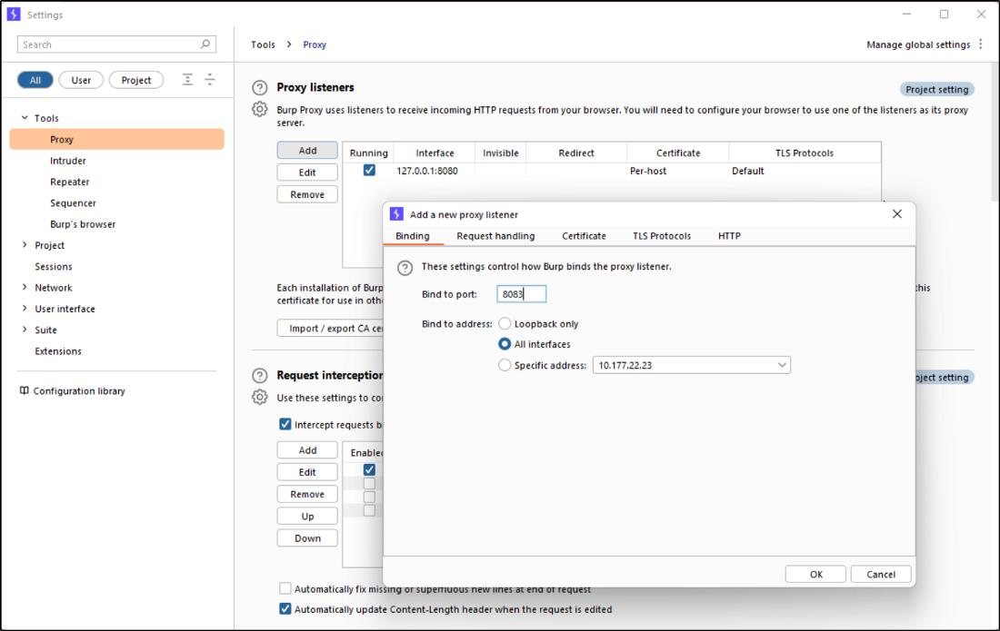

# Configure the Burp Proxy Listener

To configure the proxy settings for [Burp Suite Professional](https://portswigger.net/burp/pro):

1. Open Burp Suite Professional and click **Settings** to open the **Settings** dialog.
2. Go to **Tools > Proxy**.
3. In Proxy **Listeners**, click **Add**.
4. In the **Binding** tab, set **Bind to port** to 8083 (or another port that is not in use).
5. Select **All interfaces** and click **OK**.
6. At the prompt, click **Yes**.

Configuring the proxy listener

## This is a change no.4
