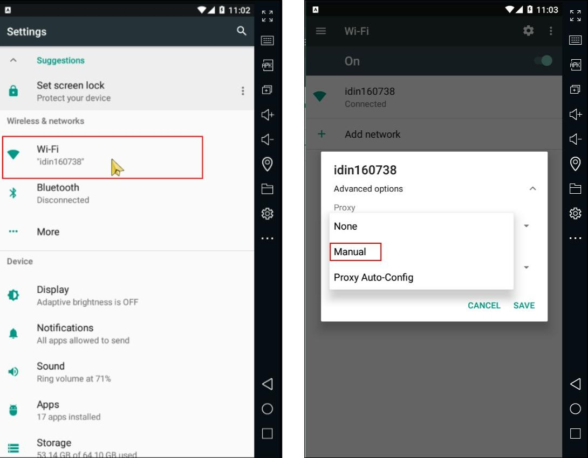
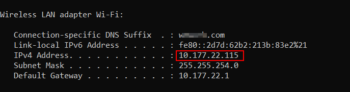
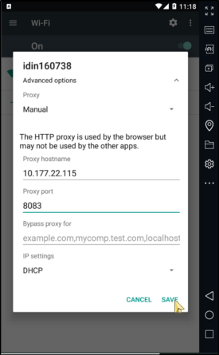

# Configure your device to use the proxy

In your Android device, go to **Settings > Network & internet**.

1. Select **Internet** and long-press the name of your Wi-Fi network.
2. Select **Modify**.
3. From the **Advanced options** menu, select **Proxy > Manual**.
4. Set **Proxy hostname** to the IP of the computer running Burp Suite Professional.
5. Set **Proxy port** to the port value that you configured for the Burp Proxy listener, in
   this example 8083.
6. Touch **Save**

