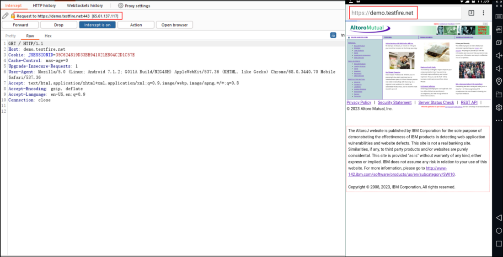

# Test the configuration/ Intercepting the request

To test the configuration:

1. Open Burp Suite Professional.
2. Go to **Proxy > Intercept** and click **Intercept is off** to switch intercept on.
3. Open the browser on your Android device and go to an HTTPS web page.

The page should load without any security warnings. You should see the corresponding requests within Burp Suite Professional.

Intercepted the browser traffic in proxy tool