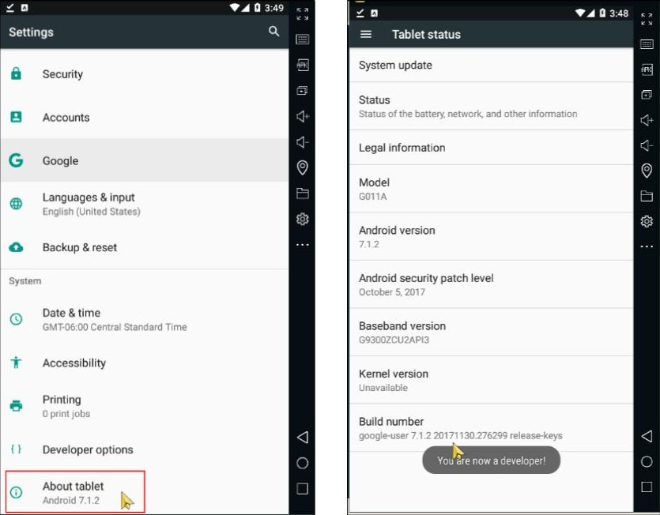
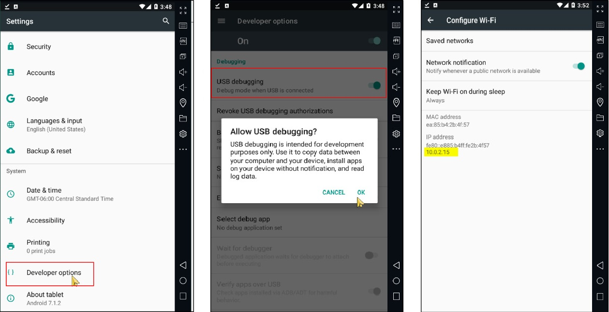
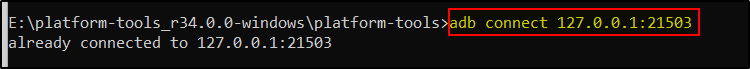
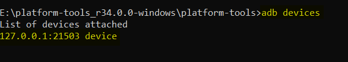

# Connecting via ADB

Enable the USB Debugging option on the device

Settings, then About Device or About Phone, depending on the device, and then we scroll down and tap on the Build Number seven times until the message “You are now a developer!” pops up.

Next, tap the back button one time and navigate to Developer Options.

Enabling USB debugging IP details

Once we get the IP of the device connect it using adb connect.
**`adb connect <ip>:5555`**
**`adb connect <ip>:21503` Memu**
**`adb connect <ip>:62001` Nox**

Since we are using emulator we can use [localhost](http://localhost) ip 127.0.0.1 as well.

This command will also start an adb server locally, waiting for new connections. According to the official ADB [documentation](https://developer.android.com/studio/command-line/adb) , port 5555 is used by the adb server, and it is the first port in a sequence that the emulator will attempt to connect to. Once the connection is established, we can use `adb devices` to list the connected devices.

