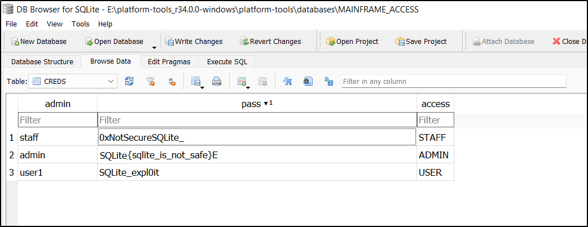

# Important directories

Below are some important directories to be aware of on an Android device:

1. /data/data: This directory contains all user-installed applications.
2. /data/user/0: This directory contains data that is private to a specific app and
   cannot be accessed by other apps.
3. /data/app: This directory contains APK files of user-installed applications.
4. /system/app: This directory contains pre-installed system applications.
5. /system/bin: This directory contains binary files.
6. /data/local/tmp: This directory is world-writable, which can be a potential security
   issue.
7. /data/system: This directory contains system configuration files.
8. /etc/apns-conf.xml: This directory contains default Access Point Name (APN)
   configurations for the device to connect with the current carrier’s network.
9. /data/misc/wifi: This directory contains WiFi configuration files.
10. /data/misc/user/0/cacerts-added: This directory contains user-added
    certificates.
11. /etc/security/cacerts/: This directory contains the system certificate store,
    which can only be accessed by root users.
12. /sdcard: This directory contains a symbolic link

In Android, the directory /data/data/ contains the installation directories of every
application that is installed on the device. This directory is private and cannot be accessed by
other apps or by non-root users. Having root access via ADB, we can list the contents of this
directory.

Applications that are stored in the internal memory of the device reside in the directory
/data/data/.

Directories like databases and shared_prefs are created as part of the installation process.

The databases directory is usually populated when the app is first run, storing structured data
in a private database.

Having access to the device via ADB, we can enumerate any available databases using the
sqlite3 client. Or else we can pull the data to the system and analyse using sqlite viewers

For example /data/data/com.app.damnvulnerablebank package is installed, and a
database is used for storing data. In that case, the database can be found under the directory
/data/data/com.app.damnvulnerablebank/databases/.

/data/data/com.app.damnvulnerablebank

Once the database is identified, we can use the sqlite3 tool to read its
content.[https://sqlitebrowser.org/dl/](https://sqlitebrowser.org/dl/)

Databases are not the only place where data is stored. In the source code, SharedPreferences
are objects that point to XML files in order to read and write on them. These XML files
eventually will contain a collection of key-value pairs, and will be stored in a directory called
shared_prefs.

shared_pref contain sensitive information.