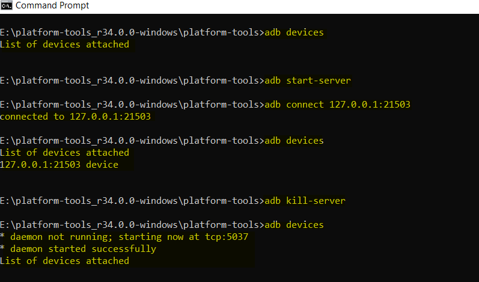
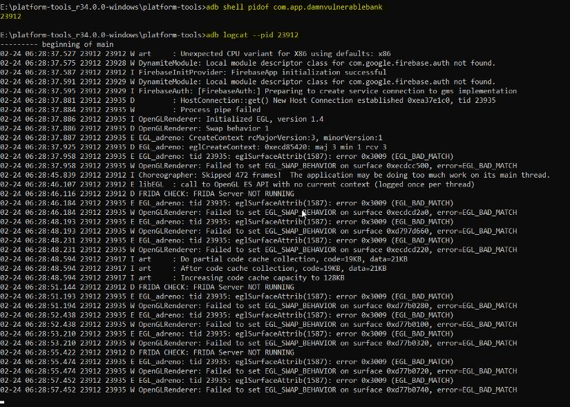

# ADB and ADB commands

ADB (Android Debug Bridge) is a command-line tool that enables communication between a
computer and an Android device. ADB provides a variety of commands that allow developers
and security testers to interact with an Android device, transfer files, install or remove
applications, and collect information for debugging or security testing purposes.

Here are some common ADB commands:

1. Lists all connected Android devices and their status.

```bash 
adb devices
```

2. Opens a shell on the Android device, allowing the user to execute commands directly on the device.
```bash 
adb shell
``` 

3. Installs an Android application on the connected device.
```bash
adb install [path to APK]
```

4. Uninstalls an application from the connected device.
```bash
adb uninstall [package name]
```

5. Copies a file from the Android device to the local computer.
```bash
adb pull [remote file path] [local file path]
```

6. Copies a file from the local computer to the Android device.
```bash 
adb push [local file path] [remote file path]
```

7. Generates a detailed bug report of the Android device, including system logs, application data, and device information.
```bash 
adb bugreport
``` 

8. Records the Android device’s screen in real-time and saves it as a video file on the local computer.
```bash
adb screenrecord
```

9. **Start/ Stop ADB server** If a device is connected start the adb server to be able to interact with the device.
```bash   
adb start-server
adb kill-server
```

10. **`adb logcat`**: Displays the Android device’s system log in real-time.<br />
    `adb logcat` Print the current device log to the console.<br />
    `adb logcat -d > [path_to_file]` Save the logcat output to a file on the local system.<br />
    `adb logcat -c` The parameter -c will clear the current logs on the device.<br />

**To capture logs of a specific app:**<br />
    `adb shell pidof com.example.app` (gives you pid of specific app)
    `adb logcat --pid 15236` displays log of that app's pid only) you can also append `-f \<filename\>` to adb logcat command
    `adb logcat packagename:[priority level: V, D, I, W, E, F, S]` Filter log
    files by priority e.g. adb logcat com.myapp:E which prints all error logs

11. Allow you to interact with an Android device’s command-line interface directly from your computer
```bash 
adb shell
```
Lists all installed packages on the Android device.
```bash 
adb shell pm list packages
```

12. Starts an activity on the Android device using an intent.
```bash 
adb shell am start [intent]
```
13. Stops an activity on the Android device using an intent.
```bash 
adb shell am force-stop com.android.settings
```

14. Simulates typing text on the Android device’s keyboard.
```bash 
adb shell input text [text]
```



