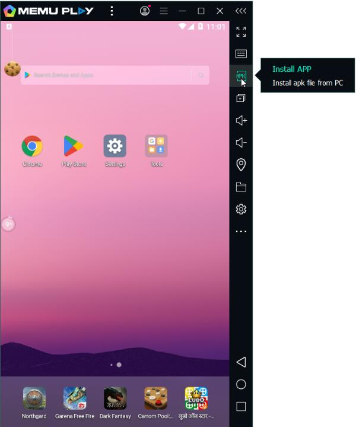

# Emulators

To start Android pentesting, you need to set up a virtual environment for the Android device.
Multiple android emulators are available like Genymotion, QEMU,Memu, NOX_Player etc.

Compared to others the set-up is more easy in Memu and Nox. So, I personally prefer Memu
or Nox_Player for testing.

An emulator provides a complete virtual environment that mimics the actual device, while a
simulator only simulates the behaviour of the device.

