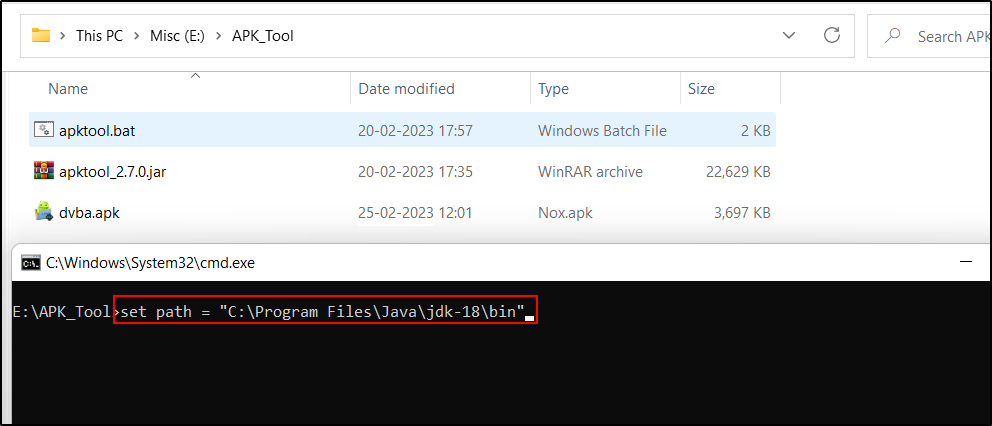

# [Apk Tool](https://ibotpeaches.github.io/Apktool/)

APKTool is an application which decompiles android APKs. It also allows you to debug the
smali code step by step. It will enable us to build a language pack by translating the .xml
strings inside APK files.

1. Download the pre-packaged APKTool zip.
2. Extract them to a directory.
3. Copy the apk file to the apktool folder.

Open command prompt and change the working directory to the apktool installed folder. Eg.
“E:\APK_Tool>l”

Set java path (if not set)using following command:`Set path=<PATH TO JAVA>`

