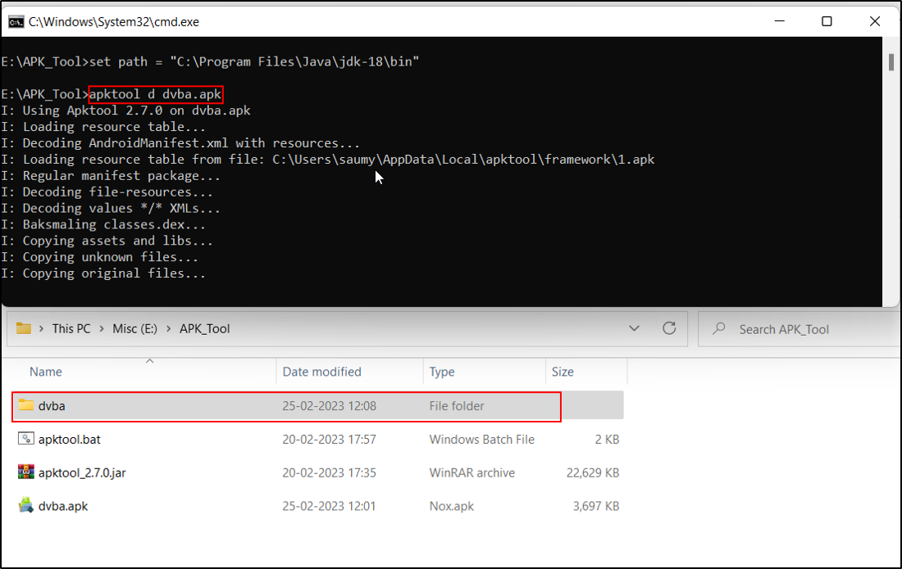
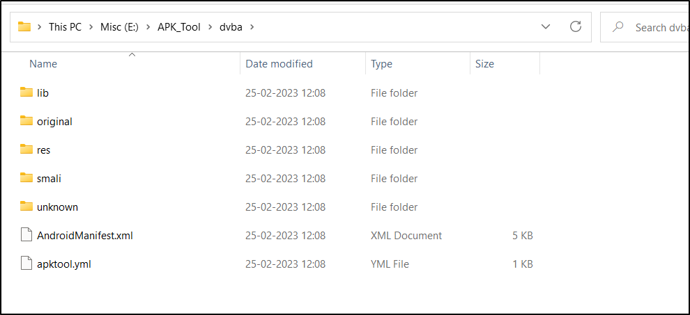

# Decompile an APK

Run command (for example consider dvba.apk) **apktool d dvba.apk**

A new folder will be created by the same name of the apk file (here example dvba.apk)

This apk folder contains AndroidManifest.xml file, apktool.yml file and smali folder. This is
decompiled form of apk.

Files obtained after decompiling the dvba.apk