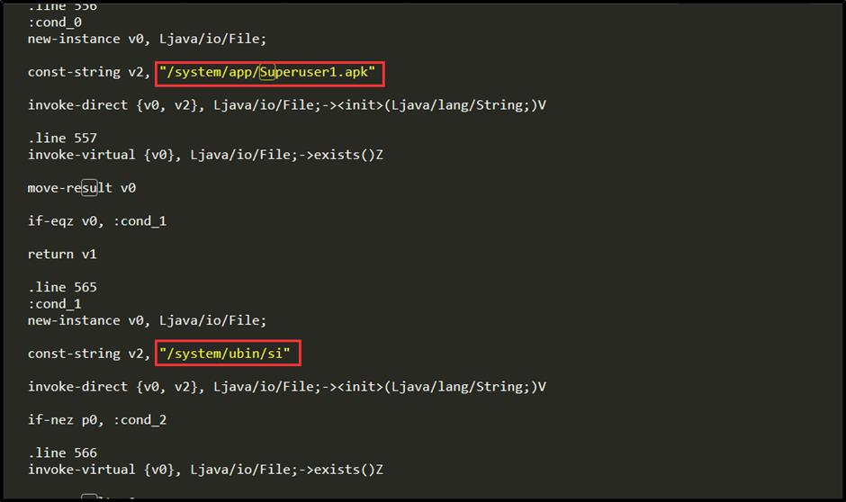
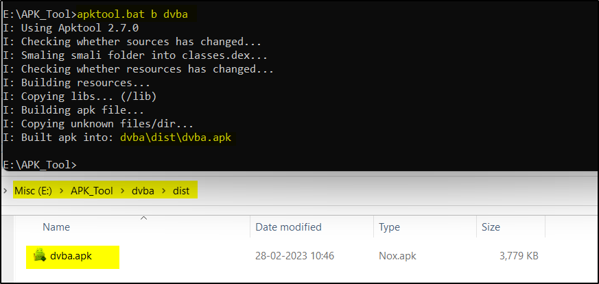

# Re-compiling and Signing

## Recompiling
1. Smali file before modification



2. Smali file after modification


3. Recompile / re-build the apk : **`apktool d <folder>`**



4. Sign the APK jarsigner.

Before the modified APK can be installed onto a device it needs to be cryptographically signed. To sign the `app_modified.apk` APK file the following steps should be taken:

## Signing

Set java path(if not set)using following command: Set path=\<PATH TO JAVA\>

1. Generate the private key.
```bash 
$ keytool -genkey -v -keystore my-release-key.keystore -alias alias_name -keyalg RSA -keysize 2048 -validity 10000
```

2. Sign the APK using the generated private key.
```bash
$ jarsigner -verbose -sigalg SHA1withRSA -digestalg SHA1 -keystore my-release-key.keystore <app_modified.apk>
```

3. If you get the Please specify alias name use the following command instead:
```bash 
$ jarsigner -verbose -sigalg SHA1withRSA -digestalg SHA1 -keystore my-release-key.keystore <app_modified.apk> alias_name
```

The modified APK should now be signed for 10,000 days and ready to be installed onto the
Android device. To do this, ensure the device has USB debugging enabled then attach the
device to the computer’s USB port and run:
```bash 
$ jarsigner -verbose -sigalg SHA1withRSA -digestalg SHA1 -keystore my-release-key.keystore PayGoWithSSL.apk alias_name
```