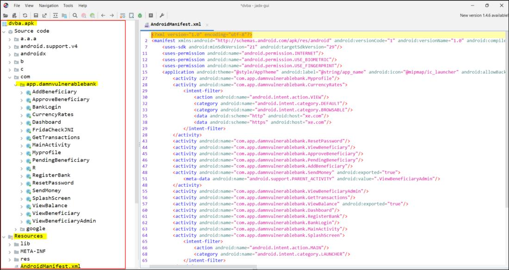

# APK → JAVA

We convert the APK file directly into the corresponding Java files. The biggest advantage of this method is, that on one hand it's less complicated!

To decompile the app from binary code directly into Java classes, we use the Android decompiler **[JADX](https://github.com/skylot/jadx)**. 
With `JADX`, we can simply open the APK file and view the source code.

### Open the apk using JADX.

