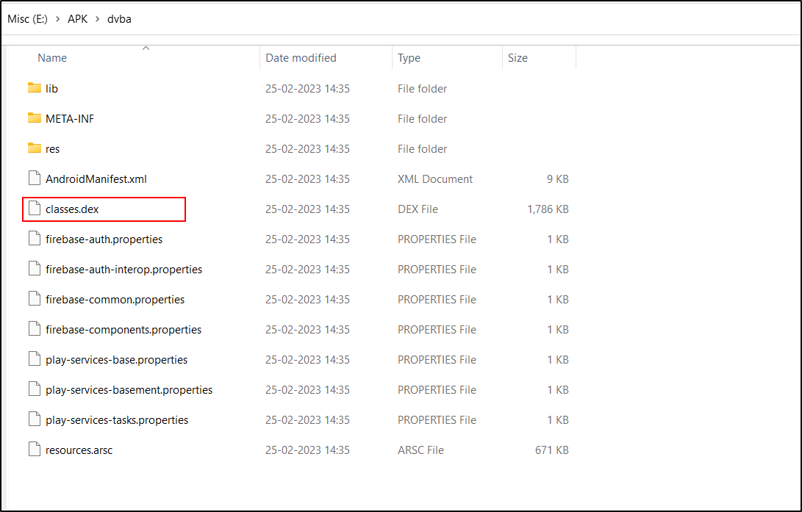
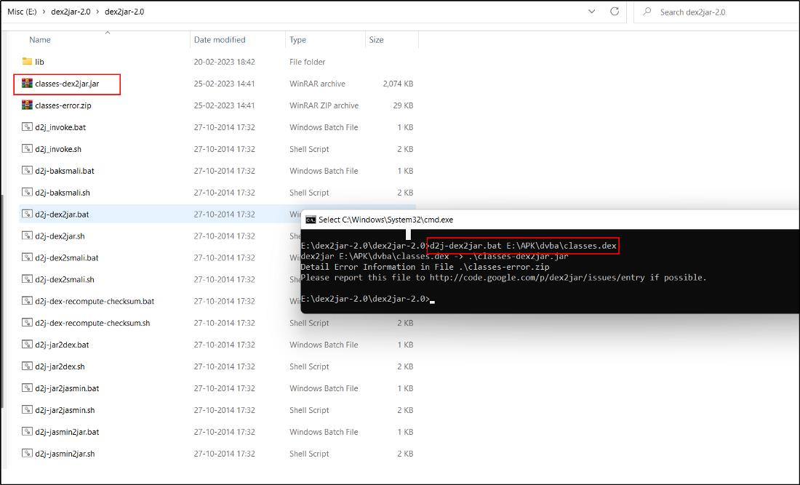
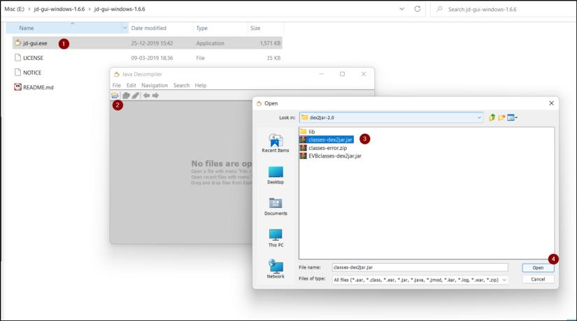
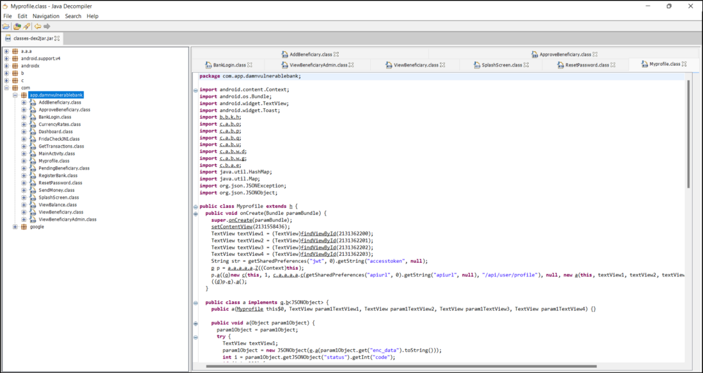

# Mainly there are 2 Methods : **DEX → JAR → JAVA** and **APK → JAVA**

1. **DEX -> JAR -> JAVA**

# Dex2Jar**

The dex files are Dalvik executable files format and are not human readable. So, we need to
convert it back to some human eye friendly language.

[https://sourceforge.net/projects/dex2jar/](https://sourceforge.net/projects/dex2jar/)

**How to get the .dex file?**

UNZIP, WINRAR

Convert the .apk file into .zip file then Extract the zipped file and under extracted folder we
find classes.dex file along with other files.

We will use a tool called dex2jar which can be used to convert .dex to JAR files

[https://github.com/pxb1988/dex2jar](https://github.com/pxb1988/dex2jar)

We get a executable jar file as shown below

**jd-gui**

Now in order to open the classes. dex2jar file we need a tool called jdgui.
For that we just open the tool and add the classes.dex2jar file in it.

Opening dex2jar in jdgui