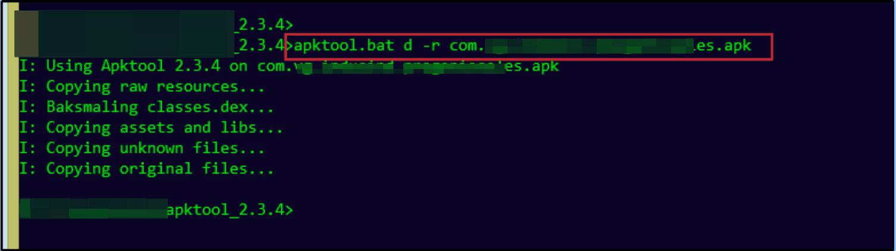
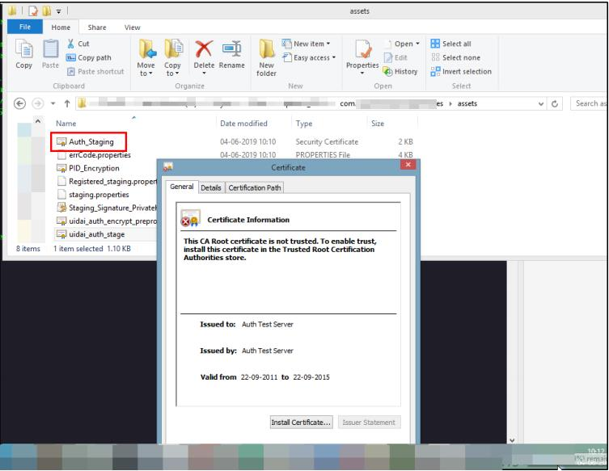
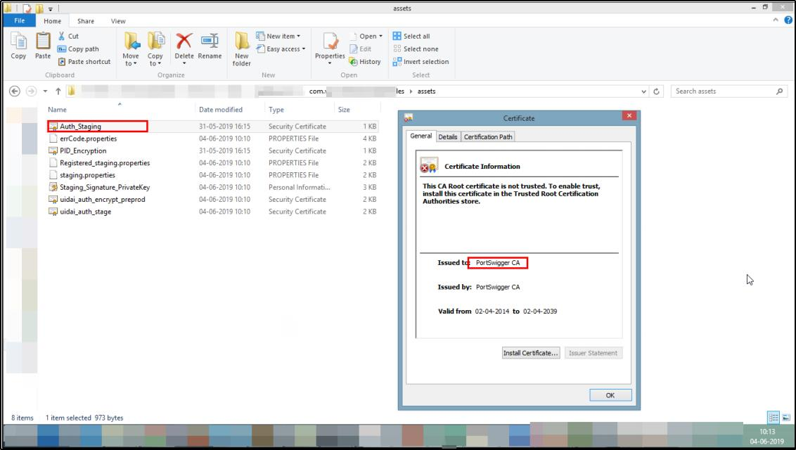
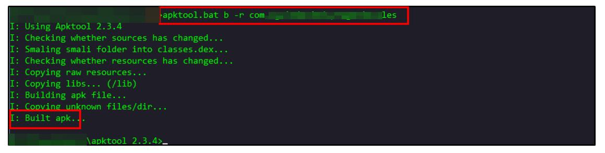

# Method 2: Reverse Engineering | Certificate Replacement.

Replace the certificate with the burp certificate.

## Step 1: Decompile the apk.

## Step 2: Find the certificate.

## Step 3: Replace the certificate with burp certificate.

## Step 4: Recompiled the apk.

## Step 5: Signed the application.

