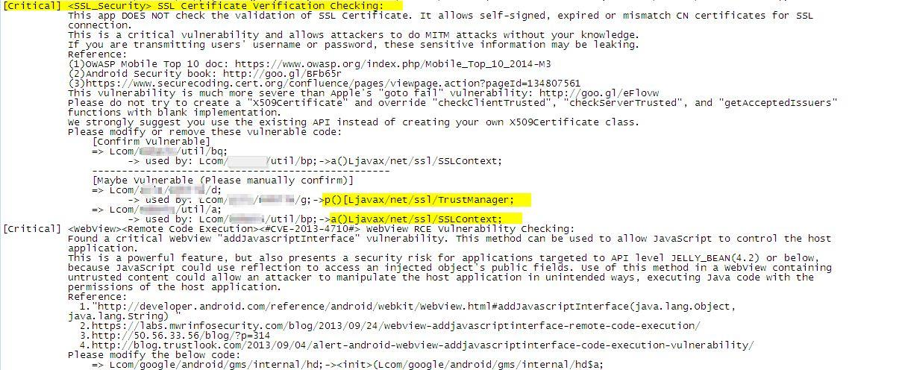
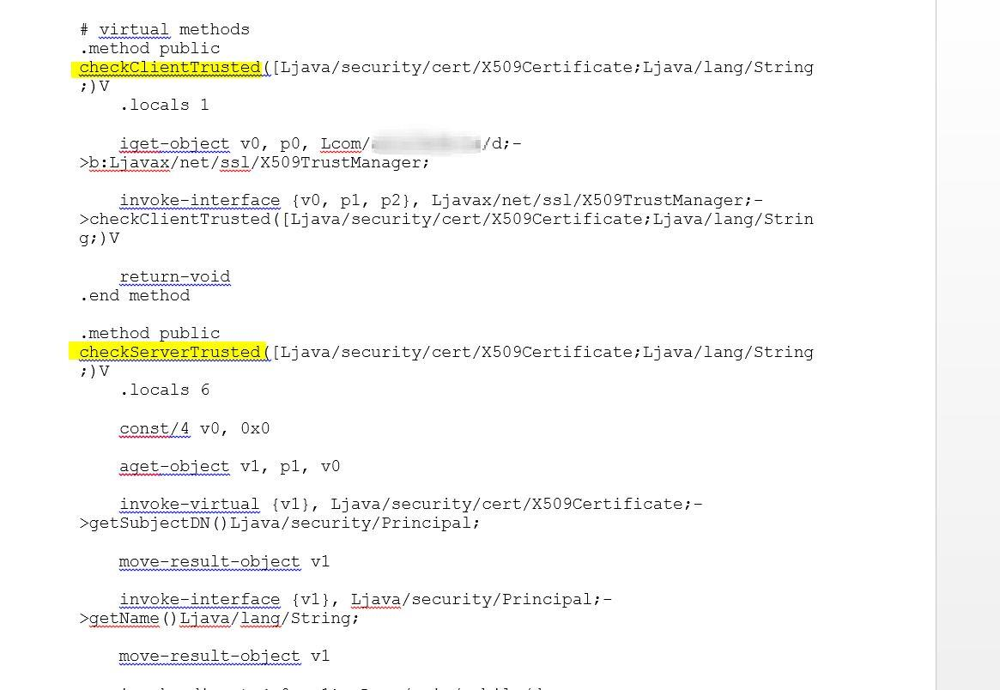
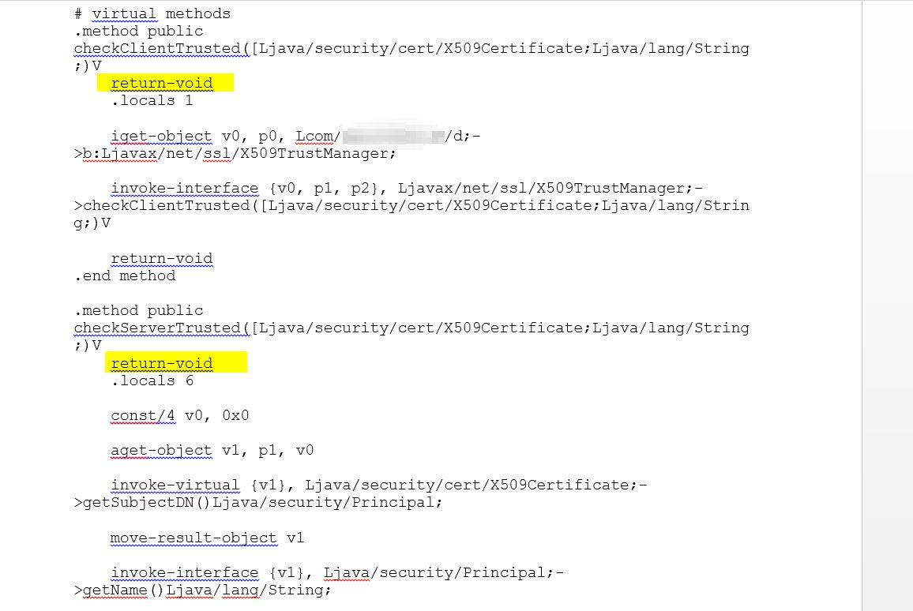

# Method 3: Reverse Engineering | Tampering TrustManagers

TrustManagers are responsible for the management of trust material (certificates, API tokens, etc.)
that are used when making decisions of authenticity and for deciding whether credentials passed on
by a peer should be accepted. In the case of SSL pinning bypass, the part we are interested in is the
references to the "**X509TrustManager**".  
The main attributes are the "**checkClientTrusted**" and "**checkServerTrusted**".

- **checkClientTrusted:**  
    The peer provided partial or complete certificate chain is used to build a
certificate path to a trusted root, return; if it can be validated and is trusted for client SSL
authentication.

- **checkServerTrusted:**  
    The server provided partial or complete certificate chain is used to build a
certificate path to a trusted root, return; if it can be validated and is trusted for server SSL
authentication.

## Step 1: 
Decompile the application using apktool6

## Step 2:
If the de-compilation is successful, the smali files can now be accessed. Smali files are
basically the decompiled classes.dex file, one receives on unzipping the .apk file. Smali file won’t
reveal the actual source code rather contains the references to the field name. Hence, are the
pseudo-code. But enough knowledge of the field name and Java class references can be passed
down by a partial-obfuscated/un-obfuscated “source code”.

## Step 3: 
This technique works by making changes to pseudo-code only if source code tampering is not
implemented or weakly configured.

## Step 4:
Run the application through a scanner which would help to narrow down to the part which
primarily deal with the secure connection establishment. Here, I have used AndroBug scanner.
Navigate to the reference of “X509TrustManager”.

## Step 5: 
Open the smali file that contains the TrustManager reference with any text editor. As shown
in the below screenshot, navigate to the following method declaration “.method public
checkClientTrusted” & “.method public checkServerTrusted”.

## Step 6: 
Type in “return-void” just below the method declaration as shown below. This statement
indicates an end of function.

## Step 7: 
Save the changes made to smali file. Re-compile the application using apktool. Then sign the
application with suitable key store.

## Step 8: 
The SSL pinning has been bypassed. Proxies can now intercept the client and server traffic.