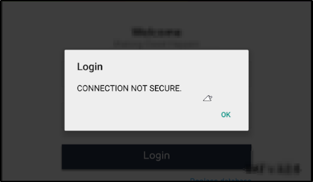
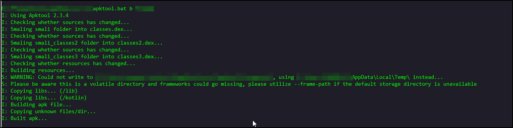
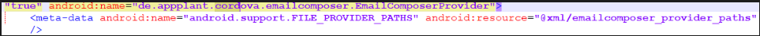
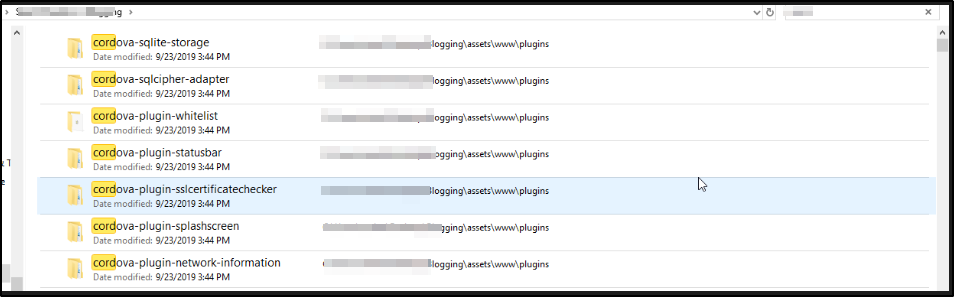
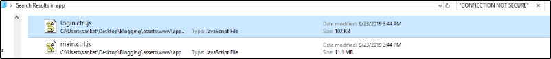
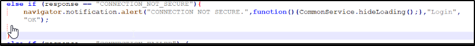
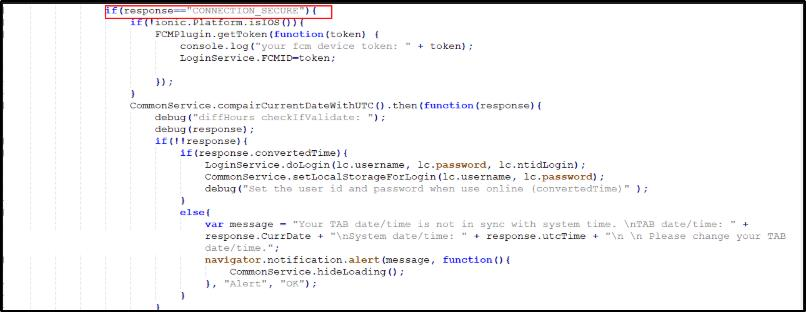
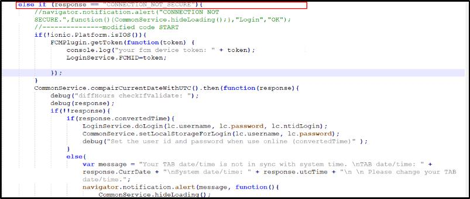

# Method 4: Reverse Engineering | Cordova Script

## What is Cordova?

Apache Cordova enables software programmers to build applications for mobile devices using CSS3,
HTML5, and JavaScript instead of relying on platform-specific APIs like those in Android, iOS, or
Windows Phone. It enables wrapping up of CSS, HTML, and JavaScript code depending upon the
platform of the device. It extends the features of HTML and JavaScript to work with the device. The
resulting applications are hybrid, meaning that they are neither truly native mobile application

How to Identify if the application is build in Cordova?

One way to identify which worked for me was using apktool to unzip the apk and found the folder
name Cordova and other method was Reading AndroidManifest.xml file.

## Step 1: 
The application throws "Connection not Secure" error.

## Step 2 : 
Decompile the apk.

## Step 3 : 
Check the AndroidManifest.xml file and folder with name Cordova

## Step 4: 
Unzip apk folder and checked for the files in assets\www\app. Holy Crap it was gold mine
containing various JavaScript files and folders.

## Step 5: 
"CONNECTION NOT SECURE" and found that Login.ctrl.js file contains that string.

## Step 6: 
Login.ctrl.js and tried to search for "CONNECTION NOT SECURE" string and understand the
logic and found that the function just pop's an alert box

## Step 7 : 
CONNECTION SECURE CODE

## Step 8: 
Copy the Code of Connection Secure to Connection not Secure

## Step 9: 
Successfully bypassed the pinning. After signing and installing the apk bypass the
"CONNECTION NOT SECURE" error

