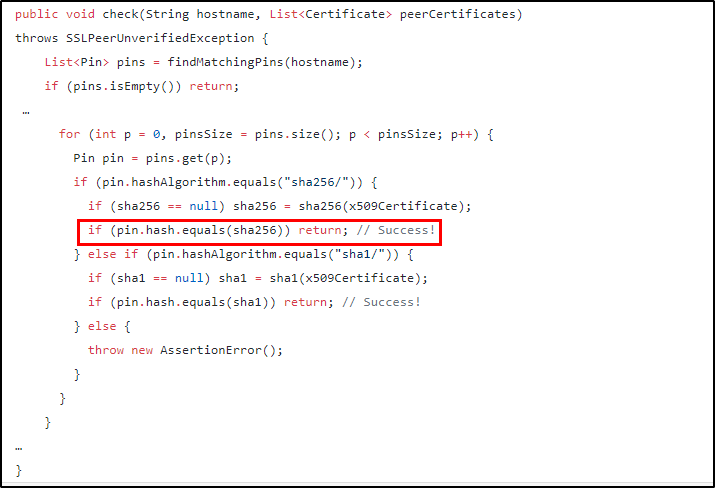
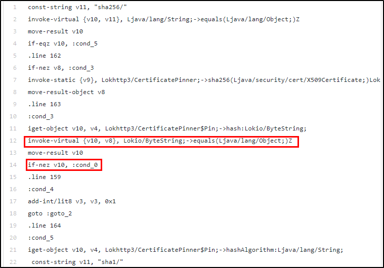

# Method 5: Reverse Engineering | OkHTTP3 Certificate Pinning Modification

HTTP is the way modern applications network. It’s how we exchange data & media. Doing HTTP
efficiently makes your stuff load faster and saves bandwidth.

OkHttp is an HTTP client that’s efficient by default

- HTTP/2 support allows all requests to the same host to share a socket.
- Connection pooling reduces request latency (if HTTP/2 isn’t available).
- Transparent GZIP shrinks download sizes.
- Response caching avoids the network completely for repeat requests.

OkHttp perseveres when the network is troublesome it will silently recover from common
connection problems. If your service has multiple IP addresses OkHttp will attempt alternate
addresses if the first connect fails. This is necessary for IPv4+IPv6 and services hosted in redundant
data centers. OkHttp supports modern TLS features (TLS 1.3, ALPN, certificate pinning). It can be
configured to fall back for broad connectivity.

Using OkHttp is easy. Its request/response API is designed with fluent builders and immutability. It
supports both synchronous blocking calls and async calls with callbacks.

OkHttp works on Android 5.0+ (API level 21+) and on Java 8+.

OkHttp depends on Okio for high-performance I/O and the Kotlin standard library. Both are small
libraries with strong backward-compatibility.

OkHttp uses your platform's built-in TLS implementation. On Java platforms OkHttp also supports
Conscrypt, which integrates BoringSSL with Java.

The OkHttp 3.12.x branch supports Android 2.3+ (API level 9+) and Java 7+. These platforms lack
support for TLS 1.2 and should not be used.

## Step 1 
Unzip the apk.

## Step 2 
Convert the classes.dex to .jar file.

## Step 3  
Search for the pinning class available in the OkHTTP library.



if the hash matches the sha256 the certificate is verified and we return.

## Step 4 
Decompile the apk. Find the corresponding smali file.




```java
if (pin.hash.equals(sha256)) return; //Success! This condition is now performed as

invoke-virtual {v10, v8}, Lokio/ByteString;->equals(Ljava/lang/Object;)Z
```


The application uses if-nez if the return value that was stored in v10 on line 12 was non-zero. Since
we want our application to use our sha certificate so that we can view client-server communications,
we are going to swap that **if-nez** with **if-eqz.** Then, when the application checks our certificate
against the one that is pinned it will continue execution instead of exiting.

## Step 5 
Recompile and sign the application.