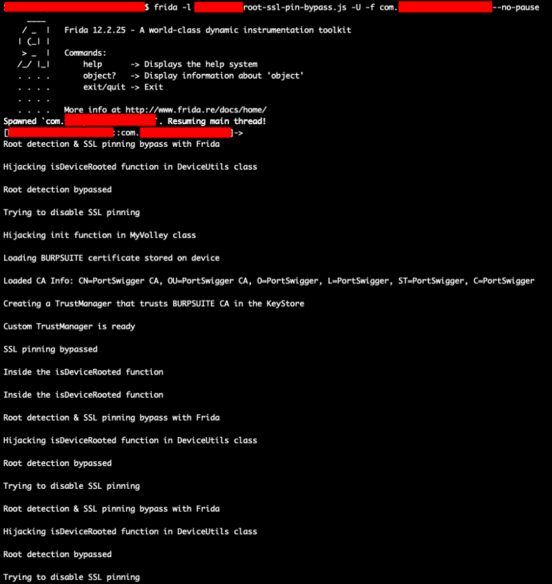
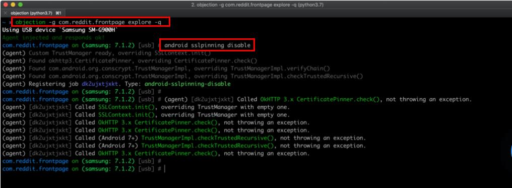

# Method 6: Hooking | Frida and Objection

Hooking is the technique used for modification or tampering of the application behaviour at
runtime. It can be achieved using **Frida** tool. Frida is the framework which can be used for dynamic
or runtime code modification. In Frida, the code is injected in the application and then modify
instruction code using the injected code.

Requirement for Frida cli tool

1. Python – latest 3.x is highly recommended
2. OS - Windows, macOS, or Linux

Frida consists of two components, viz. a client and a server which communicate with each other over
two ports(TCP) 27042 and 27043.The client can be installed by simply firing pip command as shown
below.

```bash
pip install frida
```

Once you have successfully installed Frida client on your machine, fire up your command prompt
and identify what is the version installed using the below command

frida --version

To install the server, you need to browse in the releases directory and download the file depending
upon your mobile devices platform and of the version shown as above. Ensure that the version is
correct else it work.

After downloading the file, unzip it and transfer it to your mobile device in a folder of your choice
preferably /data/local/tmp as shown below.

```bash
adb root #required
```

```bash 
adb push (path of the Frida file) /data/local/tmp(path to be saved)
```

Modify the permissions for the frida-server binary using the command below and run as shown
below.

```bash 
chmod 755 frida-server
```

Now, on your desktop, fire the below command and test the connection with the frida-server.

```bash 
frida-ps -aU
```

`-U` stands for "USB device" (Emulators are considered as usb devices.)

The output basically shows all the injectable processes currently running.


## Bypass SSL pinning with Universal Android SSL Pinning Bypass

https://codeshare.frida.re/@pcipolloni/universal-android-ssl-pinning-bypass-with-frida/

frida --codeshare pcipolloni/universal-android-ssl-pinning-bypass-with-
frida -f YOUR_BINARY




## [Installation and ssl pinning bypass using Frida objection toolkit](https://codeshare.frida.re/@pcipolloni/universal-android-ssl-pinning-bypass-with-frida/)

Objection is a runtime mobile exploration toolkit, powered by Frida. It was built with the aim of helping assess mobile applications and their security posture without the need for a jailbroken or rooted mobile device.

Run following command for installation of objection toolkit.

```bash 
pip3 install objection
```

After installation of toolkit you can bypass the ssl pinning and root detection of ios and android
application.

```bash 
Objection -g <package name/ process id> explore
```

Where, 
 - `-g` stands for **Name of the Frida Gadget/Process to connect to** 
 - `explore` stands for **objection exploration REPL**

and run **`android sslpinning disable`**

